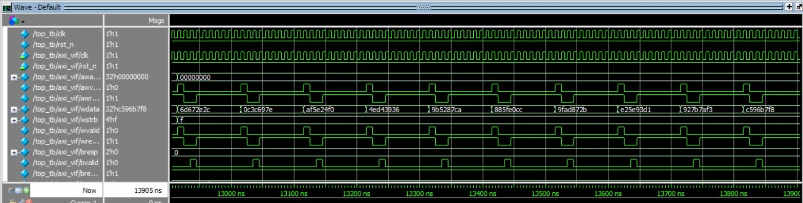

# AXI4-Lite Slave Verification using UVM (QuestaSim)

A SystemVerilog + UVM verification environment for a 32-bit AXI4-Lite slave DUT with a 16×32 register file.

## Features

- Complete UVM testbench (driver, monitor, scoreboard, coverage)
- Negative tests (misaligned address, out-of-range access)
- SVA assertions bound to the interface
- QuestaSim compile and run scripts
- Functional coverage targeting 85–90%

## Repository Structure

```
axi4lite-uvm/
├── rtl/
│   ├── axi4lite_slave.sv      # AXI4-Lite slave module
│   └── regfile.sv             # 16×32 register file
├── tb/
│   ├── top_tb.sv              # Top-level testbench
│   ├── axi_if.sv              # AXI4-Lite interface
│   └── pkg/
│       ├── axi_pkg.sv         # Package imports
│       ├── axi_item.sv        # Sequence item
│       ├── axi_sequencer.sv   # Sequencer
│       ├── axi_driver.sv      # Driver
│       ├── axi_monitor.sv     # Monitor
│       ├── axi_agent.sv       # Agent
│       ├── axi_scoreboard.sv  # Scoreboard
│       ├── axi_coverage.sv    # Functional coverage
│       ├── axi_env.sv         # Environment
│       ├── axi_sequences.sv   # Test sequences
│       └── axi_tests.sv       # Test classes
├── sva/
│   └── axi_sva_bind.sv        # Assertion bindings
└── scripts/
    ├── compile.do             # QuestaSim compile script
    └── run.do                 # QuestaSim run script
```

## DUT Specification

### AXI4-Lite Slave (`rtl/axi4lite_slave.sv`)

| Feature | Description |
|---------|-------------|
| Registers | 16 × 32-bit at addresses `0x00` – `0x3C` |
| Addressing | Index = `addr[5:2]` |
| Alignment | Requires `addr[1:0] == 2'b00` |
| Valid Access | Returns `OKAY` (`2'b00`) |
| Invalid Access | Returns `SLVERR` (`2'b10`) for misaligned or out-of-range |

The slave handles AW and W channels in any order, buffering until both are received.

### Register File (`rtl/regfile.sv`)

- 16 × 32-bit storage
- Byte-enable writes via `WSTRB`

## Interface

### `tb/axi_if.sv`

Defines all AXI4-Lite signals with two clocking blocks:
- `drv_cb` – Driver timing
- `mon_cb` – Monitor sampling

### `tb/top_tb.sv`

- Generates clock and reset
- Instantiates interface and DUT
- Registers virtual interface via `uvm_config_db`
- Invokes `run_test()` (test selected via `+UVM_TESTNAME`)

## UVM Testbench Architecture

```
top_tb
 └── run_test()
      └── axi_env
           ├── axi_agent
           │    ├── axi_driver
           │    ├── axi_sequencer
           │    └── axi_monitor ──► analysis_port
           ├── axi_scoreboard ◄── analysis_imp
           └── axi_coverage   ◄── analysis_imp
```

### Components

| Component | Description |
|-----------|-------------|
| `axi_driver` | Drives AXI4-Lite transactions on the bus |
| `axi_monitor` | Reconstructs transactions from handshakes |
| `axi_scoreboard` | Golden register model, checks data and response |
| `axi_coverage` | Coverpoints and crosses for coverage closure |

## Assertions

### `sva/axi_sva_bind.sv`

Binds AXI protocol stability assertions to the interface:

```
valid && !ready |=> valid
```

Applied to AW, W, AR, B, and R channels.

## Running in QuestaSim

### Prerequisites

- QuestaSim (or ModelSim with UVM support)
- UVM 1.2 library

### Compile

```tcl
cd C:/path/to/axi4lite-uvm
do scripts/compile.do
```

### Run Sanity Test

```tcl
do scripts/run.do
```

### Run Full Coverage Test

```tcl
set TEST full_coverage_test
set VERB UVM_MEDIUM
do scripts/run.do
```

### Save Coverage Database

```tcl
coverage save -onexit fullcov.ucdb
```

## Test Results

### Waveform



*QuestaSim waveform showing AXI4-Lite write transactions with clock, reset, address, data, and handshake signals.*

### Simulation Log

```
vsim -uvmcontrol=all -coverage -voptargs="+acc" work.top_tb \
     "+UVM_TESTNAME=full_coverage_test" "+UVM_VERBOSITY=UVM_MEDIUM"

----------------------------------------------------------------
UVM-1.1d
(C) 2007-2013 Mentor Graphics Corporation
(C) 2007-2013 Cadence Design Systems, Inc.
(C) 2006-2013 Synopsys, Inc.
(C) 2011-2013 Cypress Semiconductor Corp.
----------------------------------------------------------------

### AXI4LITE_SLAVE BUILD STAMP: AXI4LITE_V2_XSAFE ###
UVM_INFO @ 0: reporter [RNTST] Running test full_coverage_test...

UVM_INFO @ 13905: uvm_test_top.env.cov [FCOV] Functional coverage = 89.71%
UVM_INFO @ 13905: uvm_test_top.env.sb  [SB_SUMMARY]
---------------- SCOREBOARD SUMMARY ----------------
Total WRITE transactions : 250
Total READ  transactions : 26
Total AXI transactions   : 276
Total functional errors  : 0
----------------------------------------------------

--- UVM Report Summary ---
UVM_INFO    : 7
UVM_WARNING : 0
UVM_ERROR   : 0
UVM_FATAL   : 0

Time: 13905 ns
```

### Scoreboard Summary (`full_coverage_test`)

```
---------------- SCOREBOARD SUMMARY ----------------
Total WRITE transactions : 250
Total READ  transactions : 26
Total AXI transactions   : 276
Total functional errors  : 0
----------------------------------------------------
```

### UVM Report

```
UVM_INFO    : 7
UVM_WARNING : 0
UVM_ERROR   : 0
UVM_FATAL   : 0
```

### Functional Coverage

| Coverpoint | Coverage |
|------------|----------|
| `kind` | 100.00% |
| `addr` | 94.12% |
| `wstrb` | 100.00% |
| `resp` | 50.00% |
| **`kind_addr_resp`** (cross) | 94.12% |
| **`wr_addr_wstrb`** (cross) | 100.00% |
| **Overall** | **89.71%** |

### Coverage Notes

The `resp` coverpoint is at 50% because `SLVERR` responses (from misaligned or out-of-range accesses) are less frequently exercised. To improve coverage:

- Add more misaligned address tests (`addr[1:0] != 2'b00`)
- Add more out-of-range address tests (`addr >= 0x40`)

View coverage in QuestaSim: **Tools → Coverage → Show Coverage Report**

## Repository

🔗 **GitHub**: [https://github.com/PRAYAG2000n/axi4lite-uvm](https://github.com/PRAYAG2000n/axi4lite-uvm)


## Author

**Prayag** — [@PRAYAG2000n](https://github.com/PRAYAG2000n)
